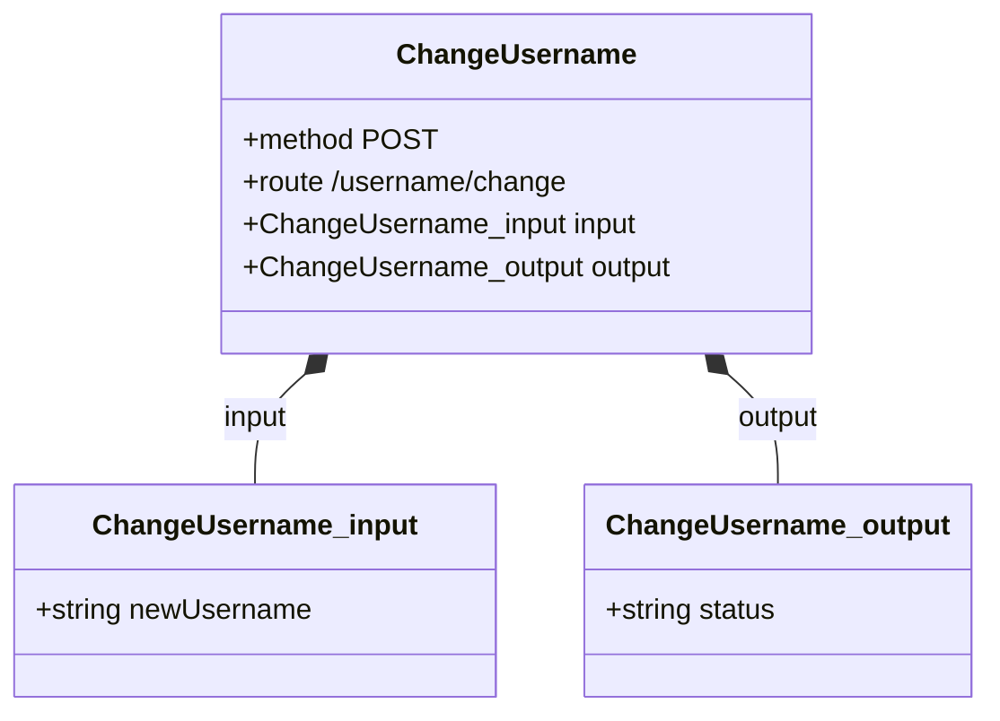

# ChangeUsername

```mermaid
classDiagram
  class ChangeUsername {
    +method POST
    +route /username/change
    +ChangeUsername_input input
    +ChangeUsername_output output
  }
  class ChangeUsername_input {
    +string newUsername
  }
  class ChangeUsername_output {
    +string status
  }
  ChangeUsername *-- ChangeUsername_input : input
  ChangeUsername *-- ChangeUsername_output : output
```
