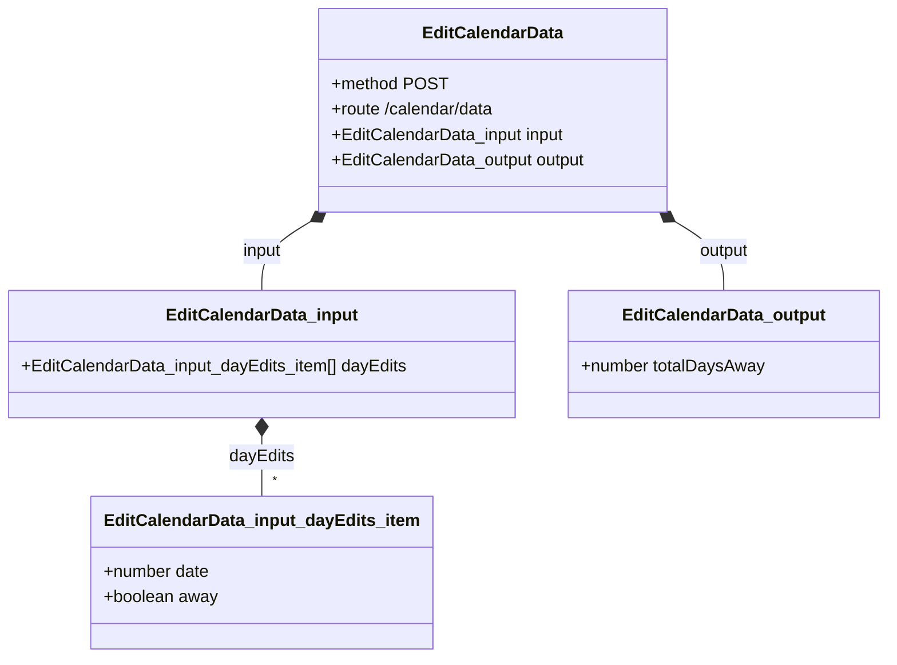

# EditCalendarData

```mermaid
classDiagram
  class EditCalendarData {
    +method POST
    +route /calendar/data
    +EditCalendarData_input input
    +EditCalendarData_output output
  }
  class EditCalendarData_input_dayEdits_item {
    +number date
    +boolean away
  }
  class EditCalendarData_input {
    +EditCalendarData_input_dayEdits_item[] dayEdits
  }
  class EditCalendarData_output {
    +number totalDaysAway
  }
  EditCalendarData_input *-- "*" EditCalendarData_input_dayEdits_item : dayEdits
  EditCalendarData *-- EditCalendarData_input : input
  EditCalendarData *-- EditCalendarData_output : output
```
