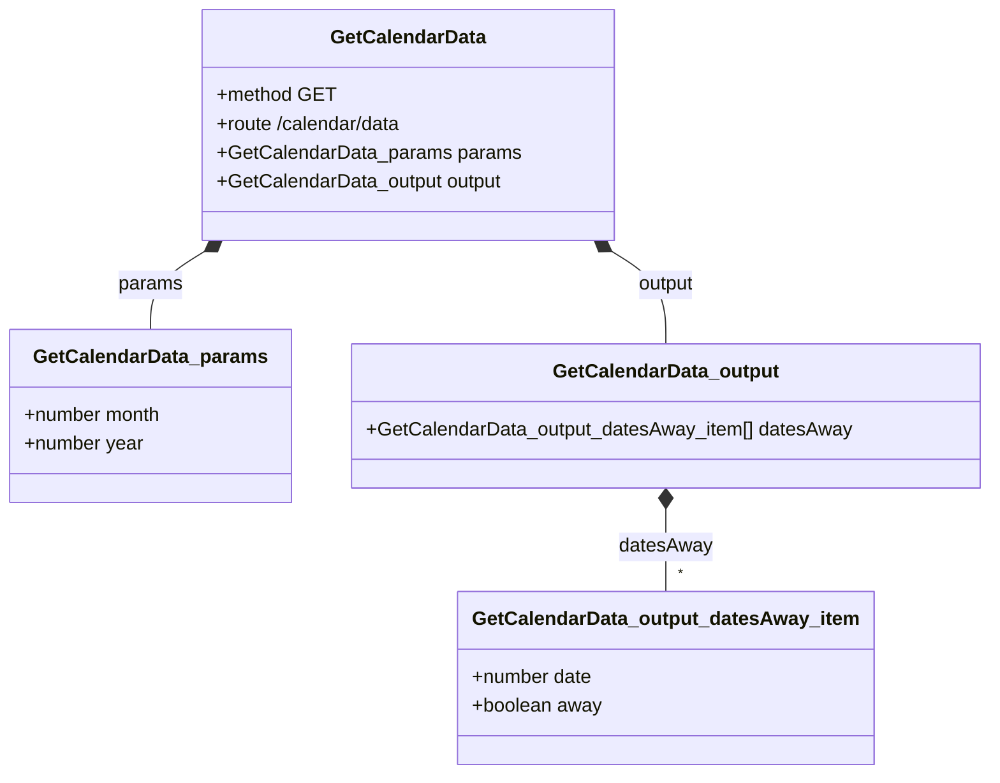

# GetCalendarData

```mermaid
classDiagram
  class GetCalendarData {
    +method GET
    +route /calendar/data
    +GetCalendarData_params params
    +GetCalendarData_output output
  }
  class GetCalendarData_params {
    +number month
    +number year
  }
  class GetCalendarData_output_datesAway_item {
    +number date
    +boolean away
  }
  class GetCalendarData_output {
    +GetCalendarData_output_datesAway_item[] datesAway
  }
  GetCalendarData *-- GetCalendarData_params : params
  GetCalendarData_output *-- "*" GetCalendarData_output_datesAway_item : datesAway
  GetCalendarData *-- GetCalendarData_output : output
```
