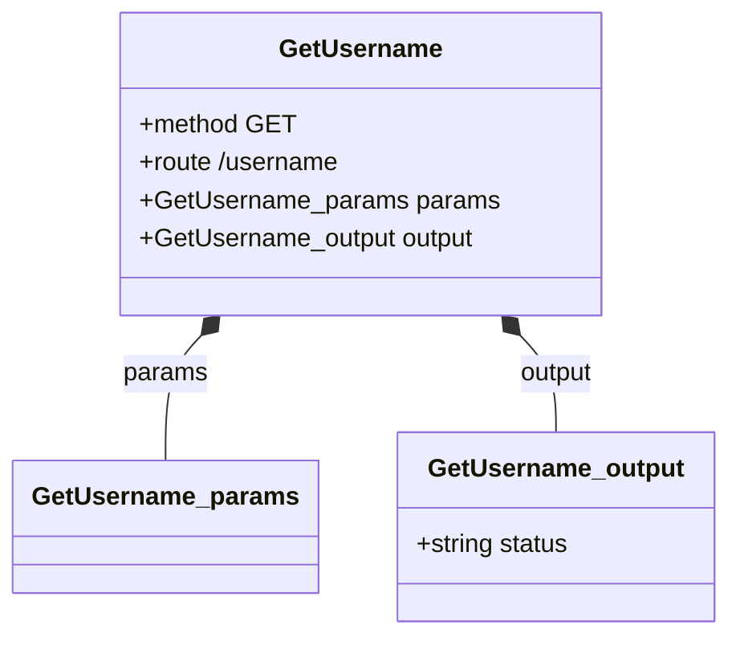

<!-- @generated by codegen-engine. Do not edit. -->
# GetUsername

```mermaid
classDiagram
  class GetUsername {
    +method GET
    +route /username
    +GetUsername_params params
    +GetUsername_output output
  }
  class GetUsername_params
  class GetUsername_output {
    +string status
  }
  GetUsername *-- GetUsername_params : params
  GetUsername *-- GetUsername_output : output
```
