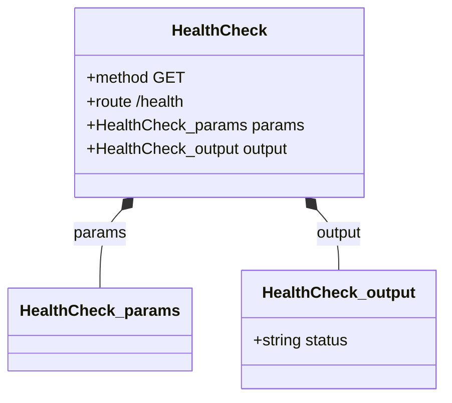

# HealthCheck

```mermaid
classDiagram
  class HealthCheck {
    +method GET
    +route /health
    +HealthCheck_params params
    +HealthCheck_output output
  }
  class HealthCheck_params
  class HealthCheck_output {
    +string status
  }
  HealthCheck *-- HealthCheck_params : params
  HealthCheck *-- HealthCheck_output : output
```
