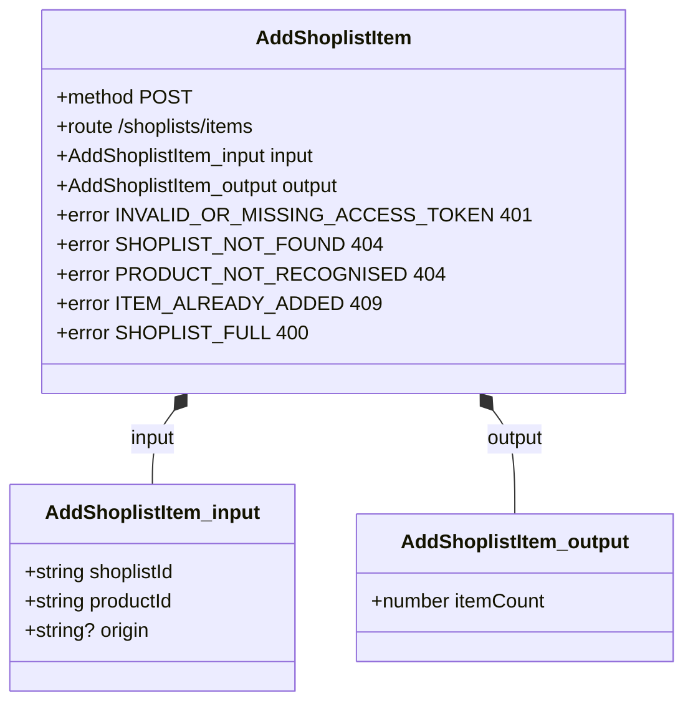

# AddShoplistItem

```mermaid
classDiagram
  class AddShoplistItem {
    +method POST
    +route /shoplists/items
    +AddShoplistItem_input input
    +AddShoplistItem_output output
    +error INVALID_OR_MISSING_ACCESS_TOKEN 401
    +error SHOPLIST_NOT_FOUND 404
    +error PRODUCT_NOT_RECOGNISED 404
    +error ITEM_ALREADY_ADDED 409
    +error SHOPLIST_FULL 400
  }
  class AddShoplistItem_input {
    +string shoplistId
    +string productId
    +string? origin
  }
  class AddShoplistItem_output {
    +number itemCount
  }
  AddShoplistItem *-- AddShoplistItem_input : input
  AddShoplistItem *-- AddShoplistItem_output : output
```
