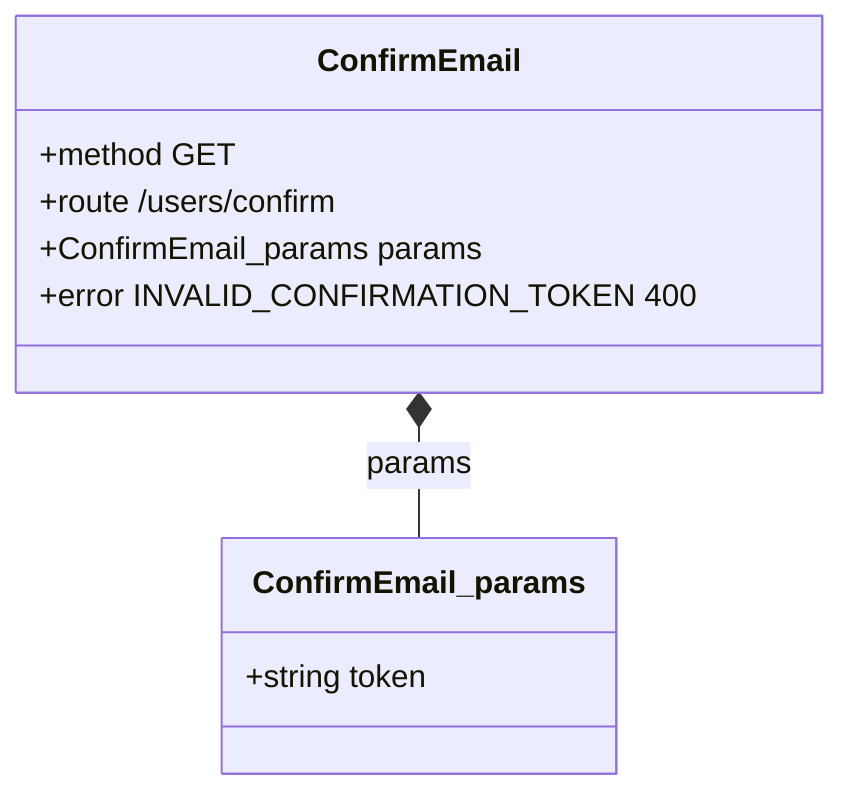

# ConfirmEmail

```mermaid
classDiagram
  class ConfirmEmail {
    +method GET
    +route /users/confirm
    +ConfirmEmail_params params
    +error INVALID_CONFIRMATION_TOKEN 400
  }
  class ConfirmEmail_params {
    +string token
  }
  ConfirmEmail *-- ConfirmEmail_params : params
```
