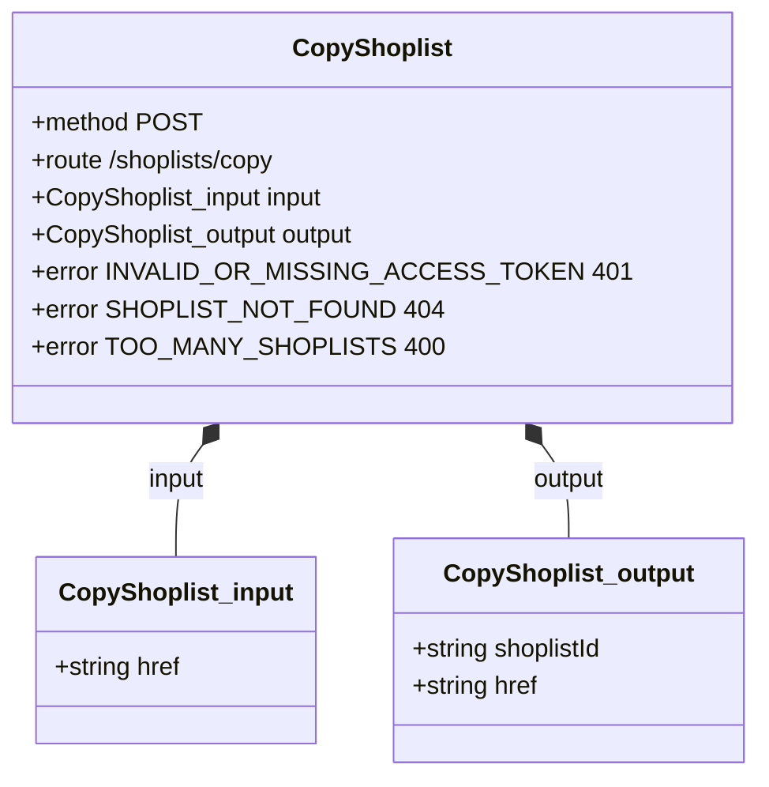

# CopyShoplist

```mermaid
classDiagram
  class CopyShoplist {
    +method POST
    +route /shoplists/copy
    +CopyShoplist_input input
    +CopyShoplist_output output
    +error INVALID_OR_MISSING_ACCESS_TOKEN 401
    +error SHOPLIST_NOT_FOUND 404
    +error TOO_MANY_SHOPLISTS 400
  }
  class CopyShoplist_input {
    +string href
  }
  class CopyShoplist_output {
    +string shoplistId
    +string href
  }
  CopyShoplist *-- CopyShoplist_input : input
  CopyShoplist *-- CopyShoplist_output : output
```
