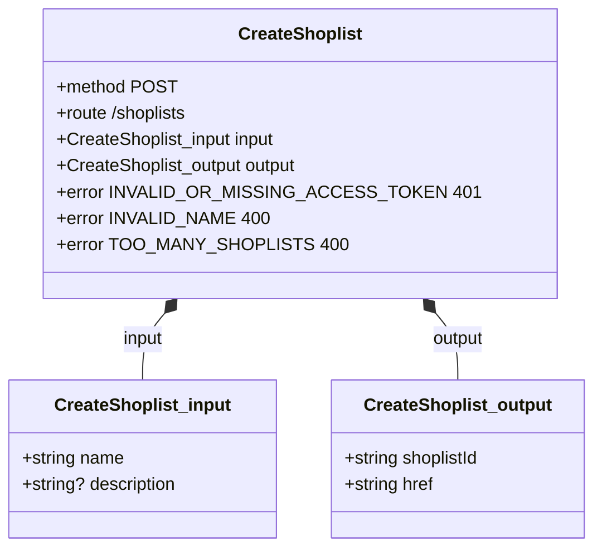

# CreateShoplist

```mermaid
classDiagram
  class CreateShoplist {
    +method POST
    +route /shoplists
    +CreateShoplist_input input
    +CreateShoplist_output output
    +error INVALID_OR_MISSING_ACCESS_TOKEN 401
    +error INVALID_NAME 400
    +error TOO_MANY_SHOPLISTS 400
  }
  class CreateShoplist_input {
    +string name
    +string? description
  }
  class CreateShoplist_output {
    +string shoplistId
    +string href
  }
  CreateShoplist *-- CreateShoplist_input : input
  CreateShoplist *-- CreateShoplist_output : output
```
