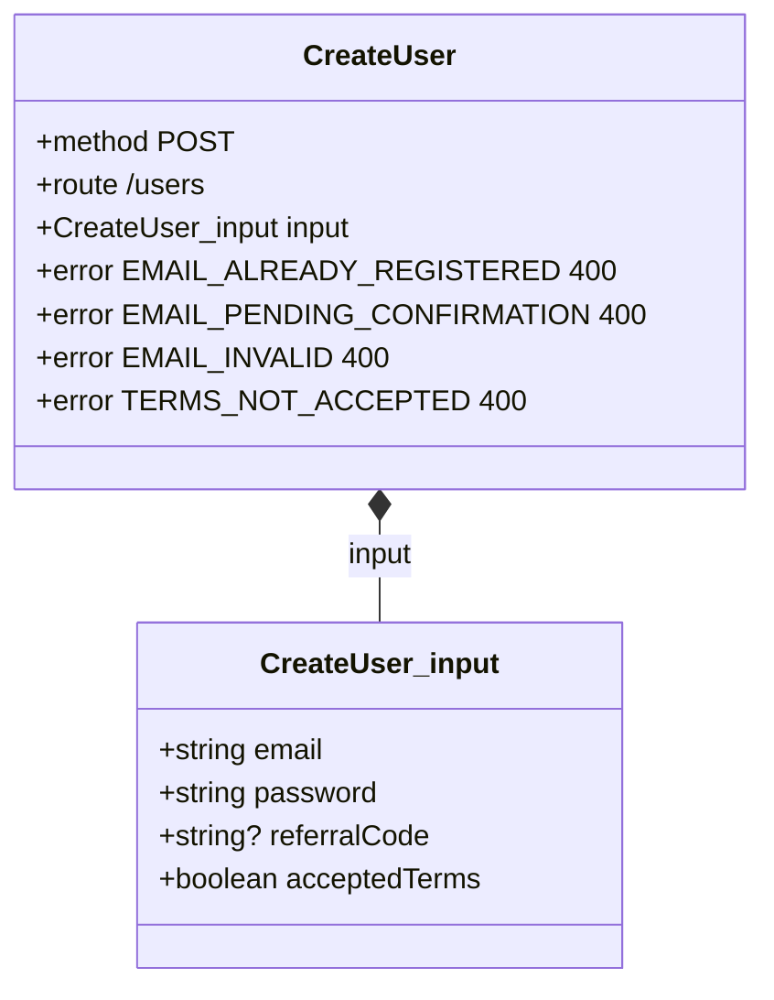

# CreateUser

```mermaid
classDiagram
  class CreateUser {
    +method POST
    +route /users
    +CreateUser_input input
    +error EMAIL_ALREADY_REGISTERED 400
    +error EMAIL_PENDING_CONFIRMATION 400
    +error EMAIL_INVALID 400
    +error TERMS_NOT_ACCEPTED 400
  }
  class CreateUser_input {
    +string email
    +string password
    +string? referralCode
    +boolean acceptedTerms
  }
  CreateUser *-- CreateUser_input : input
```
