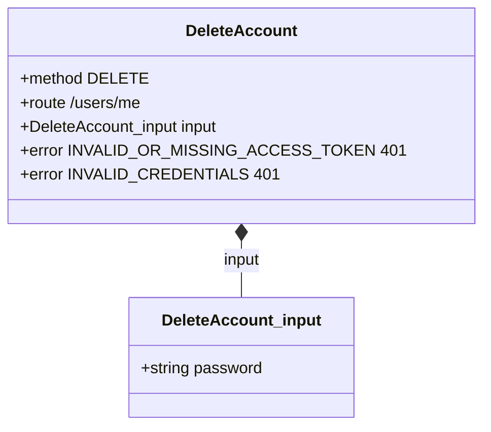

# DeleteAccount

```mermaid
classDiagram
  class DeleteAccount {
    +method DELETE
    +route /users/me
    +DeleteAccount_input input
    +error INVALID_OR_MISSING_ACCESS_TOKEN 401
    +error INVALID_CREDENTIALS 401
  }
  class DeleteAccount_input {
    +string password
  }
  DeleteAccount *-- DeleteAccount_input : input
```
