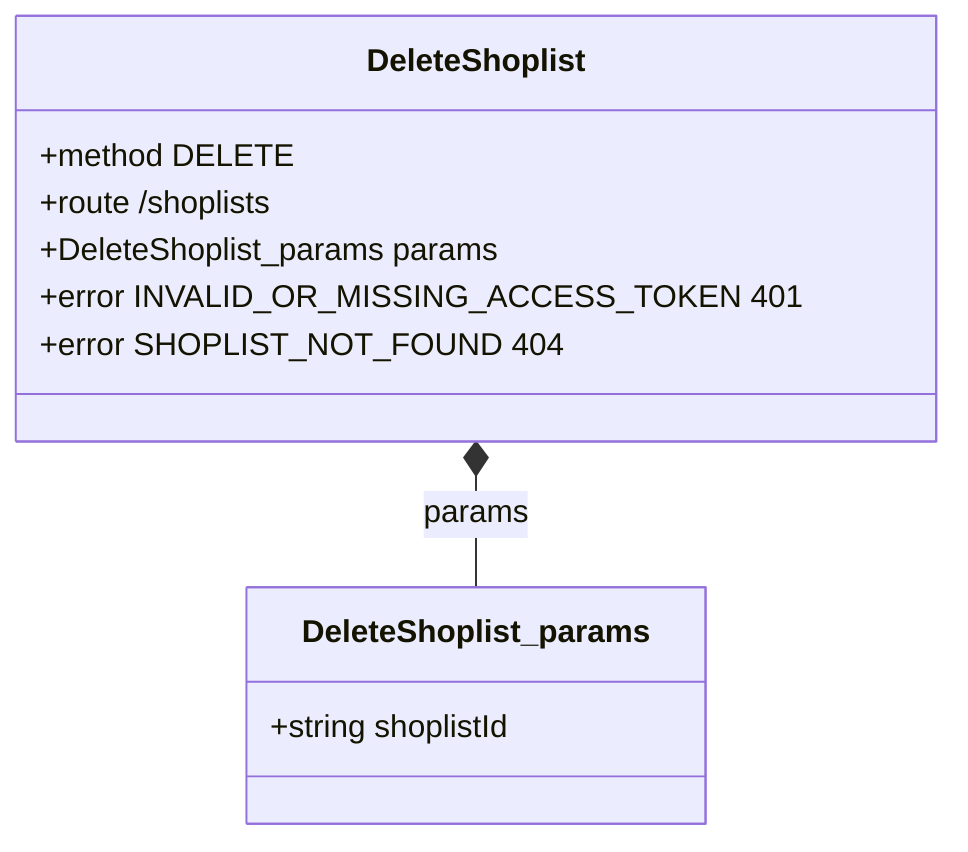

# DeleteShoplist

```mermaid
classDiagram
  class DeleteShoplist {
    +method DELETE
    +route /shoplists
    +DeleteShoplist_params params
    +error INVALID_OR_MISSING_ACCESS_TOKEN 401
    +error SHOPLIST_NOT_FOUND 404
  }
  class DeleteShoplist_params {
    +string shoplistId
  }
  DeleteShoplist *-- DeleteShoplist_params : params
```
