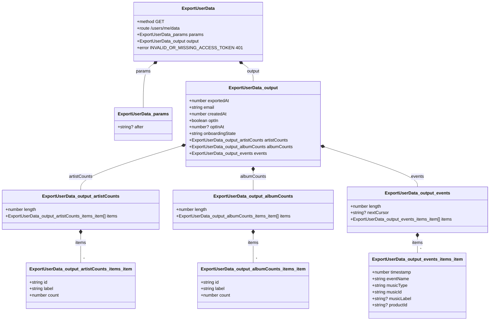

# ExportUserData

```mermaid
classDiagram
  class ExportUserData {
    +method GET
    +route /users/me/data
    +ExportUserData_params params
    +ExportUserData_output output
    +error INVALID_OR_MISSING_ACCESS_TOKEN 401
  }
  class ExportUserData_params {
    +string? after
  }
  class ExportUserData_output_artistCounts_items_item {
    +string id
    +string label
    +number count
  }
  class ExportUserData_output_artistCounts {
    +number length
    +ExportUserData_output_artistCounts_items_item[] items
  }
  class ExportUserData_output_albumCounts_items_item {
    +string id
    +string label
    +number count
  }
  class ExportUserData_output_albumCounts {
    +number length
    +ExportUserData_output_albumCounts_items_item[] items
  }
  class ExportUserData_output_events_items_item {
    +number timestamp
    +string eventName
    +string musicType
    +string musicId
    +string? musicLabel
    +string? productId
  }
  class ExportUserData_output_events {
    +number length
    +string? nextCursor
    +ExportUserData_output_events_items_item[] items
  }
  class ExportUserData_output {
    +number exportedAt
    +string email
    +number createdAt
    +boolean optIn
    +number? optInAt
    +string onboardingState
    +ExportUserData_output_artistCounts artistCounts
    +ExportUserData_output_albumCounts albumCounts
    +ExportUserData_output_events events
  }
  ExportUserData *-- ExportUserData_params : params
  ExportUserData_output_artistCounts *-- "*" ExportUserData_output_artistCounts_items_item : items
  ExportUserData_output *-- ExportUserData_output_artistCounts : artistCounts
  ExportUserData_output_albumCounts *-- "*" ExportUserData_output_albumCounts_items_item : items
  ExportUserData_output *-- ExportUserData_output_albumCounts : albumCounts
  ExportUserData_output_events *-- "*" ExportUserData_output_events_items_item : items
  ExportUserData_output *-- ExportUserData_output_events : events
  ExportUserData *-- ExportUserData_output : output
```
