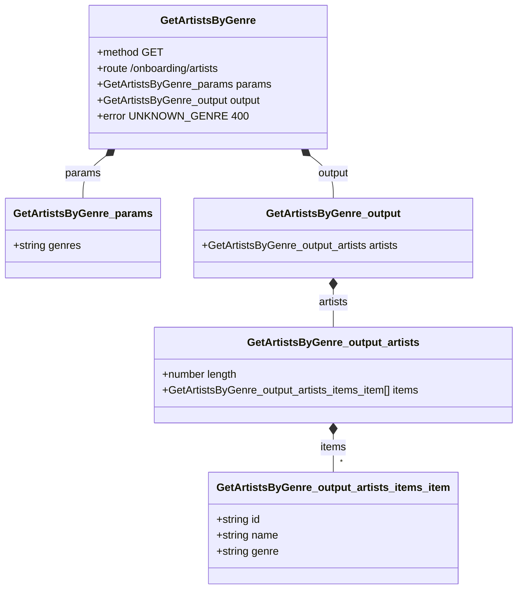

# GetArtistsByGenre

```mermaid
classDiagram
  class GetArtistsByGenre {
    +method GET
    +route /onboarding/artists
    +GetArtistsByGenre_params params
    +GetArtistsByGenre_output output
    +error UNKNOWN_GENRE 400
  }
  class GetArtistsByGenre_params {
    +string genres
  }
  class GetArtistsByGenre_output_artists_items_item {
    +string id
    +string name
    +string genre
  }
  class GetArtistsByGenre_output_artists {
    +number length
    +GetArtistsByGenre_output_artists_items_item[] items
  }
  class GetArtistsByGenre_output {
    +GetArtistsByGenre_output_artists artists
  }
  GetArtistsByGenre *-- GetArtistsByGenre_params : params
  GetArtistsByGenre_output_artists *-- "*" GetArtistsByGenre_output_artists_items_item : items
  GetArtistsByGenre_output *-- GetArtistsByGenre_output_artists : artists
  GetArtistsByGenre *-- GetArtistsByGenre_output : output
```
