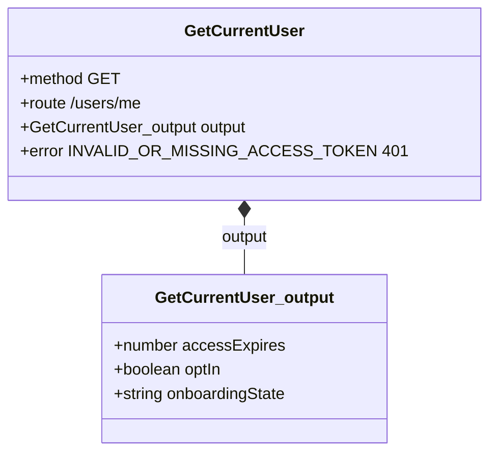

# GetCurrentUser

```mermaid
classDiagram
  class GetCurrentUser {
    +method GET
    +route /users/me
    +GetCurrentUser_output output
    +error INVALID_OR_MISSING_ACCESS_TOKEN 401
  }
  class GetCurrentUser_output {
    +number accessExpires
    +boolean optIn
    +string onboardingState
  }
  GetCurrentUser *-- GetCurrentUser_output : output
```
