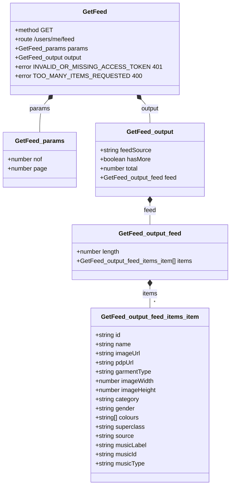

# GetFeed

```mermaid
classDiagram
  class GetFeed {
    +method GET
    +route /users/me/feed
    +GetFeed_params params
    +GetFeed_output output
    +error INVALID_OR_MISSING_ACCESS_TOKEN 401
    +error TOO_MANY_ITEMS_REQUESTED 400
  }
  class GetFeed_params {
    +number nof
    +number page
  }
  class GetFeed_output_feed_items_item {
    +string id
    +string name
    +string imageUrl
    +string pdpUrl
    +string garmentType
    +number imageWidth
    +number imageHeight
    +string category
    +string gender
    +string[] colours
    +string superclass
    +string source
    +string musicLabel
    +string musicId
    +string musicType
  }
  class GetFeed_output_feed {
    +number length
    +GetFeed_output_feed_items_item[] items
  }
  class GetFeed_output {
    +string feedSource
    +boolean hasMore
    +number total
    +GetFeed_output_feed feed
  }
  GetFeed *-- GetFeed_params : params
  GetFeed_output_feed *-- "*" GetFeed_output_feed_items_item : items
  GetFeed_output *-- GetFeed_output_feed : feed
  GetFeed *-- GetFeed_output : output
```
