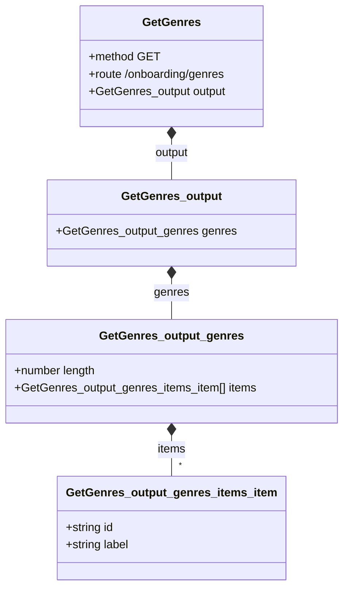

# GetGenres

```mermaid
classDiagram
  class GetGenres {
    +method GET
    +route /onboarding/genres
    +GetGenres_output output
  }
  class GetGenres_output_genres_items_item {
    +string id
    +string label
  }
  class GetGenres_output_genres {
    +number length
    +GetGenres_output_genres_items_item[] items
  }
  class GetGenres_output {
    +GetGenres_output_genres genres
  }
  GetGenres_output_genres *-- "*" GetGenres_output_genres_items_item : items
  GetGenres_output *-- GetGenres_output_genres : genres
  GetGenres *-- GetGenres_output : output
```
