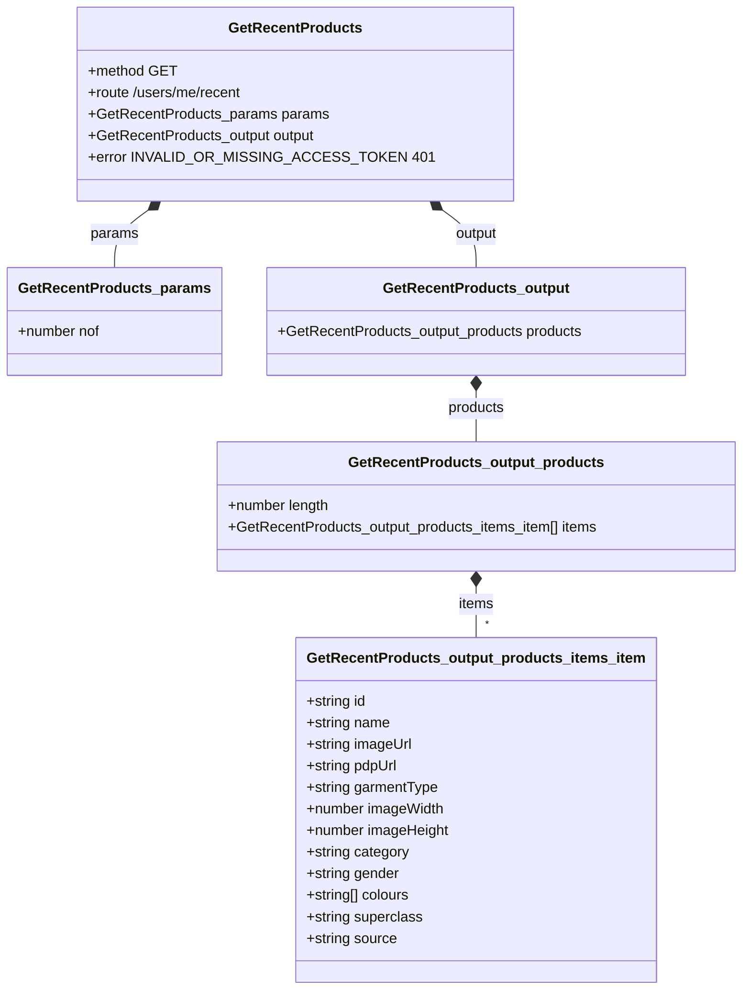

# GetRecentProducts

```mermaid
classDiagram
  class GetRecentProducts {
    +method GET
    +route /users/me/recent
    +GetRecentProducts_params params
    +GetRecentProducts_output output
    +error INVALID_OR_MISSING_ACCESS_TOKEN 401
  }
  class GetRecentProducts_params {
    +number nof
  }
  class GetRecentProducts_output_products_items_item {
    +string id
    +string name
    +string imageUrl
    +string pdpUrl
    +string garmentType
    +number imageWidth
    +number imageHeight
    +string category
    +string gender
    +string[] colours
    +string superclass
    +string source
  }
  class GetRecentProducts_output_products {
    +number length
    +GetRecentProducts_output_products_items_item[] items
  }
  class GetRecentProducts_output {
    +GetRecentProducts_output_products products
  }
  GetRecentProducts *-- GetRecentProducts_params : params
  GetRecentProducts_output_products *-- "*" GetRecentProducts_output_products_items_item : items
  GetRecentProducts_output *-- GetRecentProducts_output_products : products
  GetRecentProducts *-- GetRecentProducts_output : output
```
