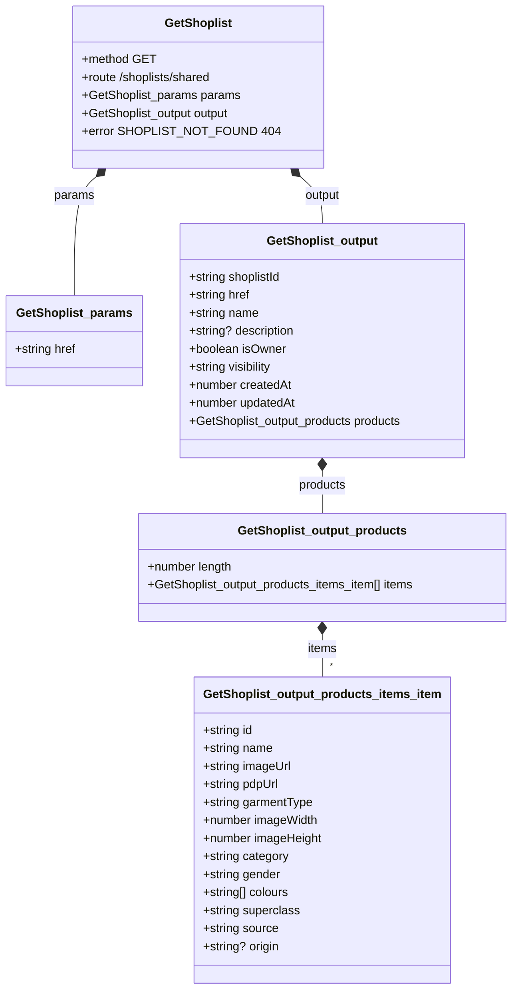

# GetShoplist

```mermaid
classDiagram
  class GetShoplist {
    +method GET
    +route /shoplists/shared
    +GetShoplist_params params
    +GetShoplist_output output
    +error SHOPLIST_NOT_FOUND 404
  }
  class GetShoplist_params {
    +string href
  }
  class GetShoplist_output_products_items_item {
    +string id
    +string name
    +string imageUrl
    +string pdpUrl
    +string garmentType
    +number imageWidth
    +number imageHeight
    +string category
    +string gender
    +string[] colours
    +string superclass
    +string source
    +string? origin
  }
  class GetShoplist_output_products {
    +number length
    +GetShoplist_output_products_items_item[] items
  }
  class GetShoplist_output {
    +string shoplistId
    +string href
    +string name
    +string? description
    +boolean isOwner
    +string visibility
    +number createdAt
    +number updatedAt
    +GetShoplist_output_products products
  }
  GetShoplist *-- GetShoplist_params : params
  GetShoplist_output_products *-- "*" GetShoplist_output_products_items_item : items
  GetShoplist_output *-- GetShoplist_output_products : products
  GetShoplist *-- GetShoplist_output : output
```
