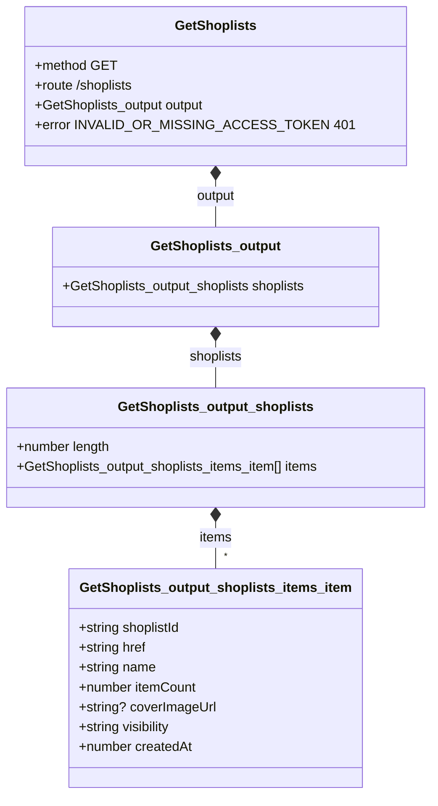

# GetShoplists

```mermaid
classDiagram
  class GetShoplists {
    +method GET
    +route /shoplists
    +GetShoplists_output output
    +error INVALID_OR_MISSING_ACCESS_TOKEN 401
  }
  class GetShoplists_output_shoplists_items_item {
    +string shoplistId
    +string href
    +string name
    +number itemCount
    +string? coverImageUrl
    +string visibility
    +number createdAt
  }
  class GetShoplists_output_shoplists {
    +number length
    +GetShoplists_output_shoplists_items_item[] items
  }
  class GetShoplists_output {
    +GetShoplists_output_shoplists shoplists
  }
  GetShoplists_output_shoplists *-- "*" GetShoplists_output_shoplists_items_item : items
  GetShoplists_output *-- GetShoplists_output_shoplists : shoplists
  GetShoplists *-- GetShoplists_output : output
```
