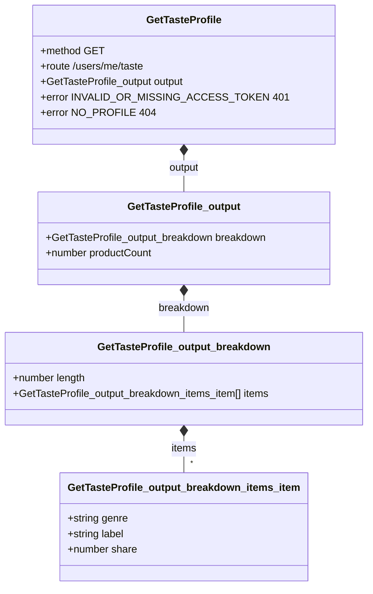

# GetTasteProfile

```mermaid
classDiagram
  class GetTasteProfile {
    +method GET
    +route /users/me/taste
    +GetTasteProfile_output output
    +error INVALID_OR_MISSING_ACCESS_TOKEN 401
    +error NO_PROFILE 404
  }
  class GetTasteProfile_output_breakdown_items_item {
    +string genre
    +string label
    +number share
  }
  class GetTasteProfile_output_breakdown {
    +number length
    +GetTasteProfile_output_breakdown_items_item[] items
  }
  class GetTasteProfile_output {
    +GetTasteProfile_output_breakdown breakdown
    +number productCount
  }
  GetTasteProfile_output_breakdown *-- "*" GetTasteProfile_output_breakdown_items_item : items
  GetTasteProfile_output *-- GetTasteProfile_output_breakdown : breakdown
  GetTasteProfile *-- GetTasteProfile_output : output
```
