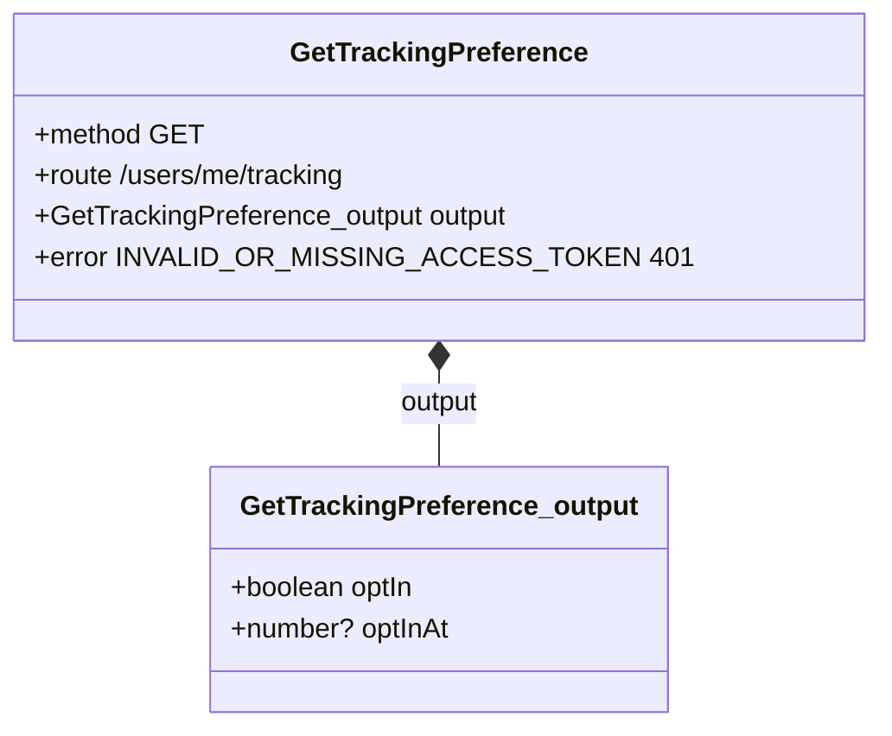

# GetTrackingPreference

```mermaid
classDiagram
  class GetTrackingPreference {
    +method GET
    +route /users/me/tracking
    +GetTrackingPreference_output output
    +error INVALID_OR_MISSING_ACCESS_TOKEN 401
  }
  class GetTrackingPreference_output {
    +boolean optIn
    +number? optInAt
  }
  GetTrackingPreference *-- GetTrackingPreference_output : output
```
