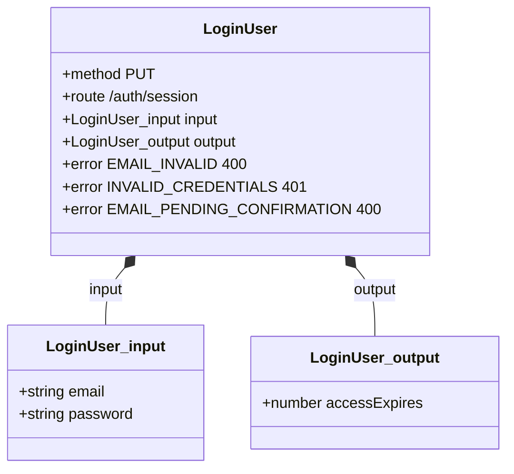

# LoginUser

```mermaid
classDiagram
  class LoginUser {
    +method PUT
    +route /auth/session
    +LoginUser_input input
    +LoginUser_output output
    +error EMAIL_INVALID 400
    +error INVALID_CREDENTIALS 401
    +error EMAIL_PENDING_CONFIRMATION 400
  }
  class LoginUser_input {
    +string email
    +string password
  }
  class LoginUser_output {
    +number accessExpires
  }
  LoginUser *-- LoginUser_input : input
  LoginUser *-- LoginUser_output : output
```
