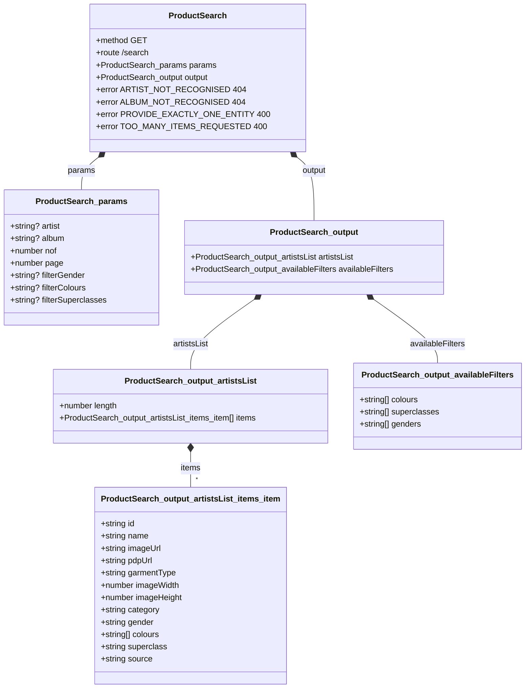

# ProductSearch

```mermaid
classDiagram
  class ProductSearch {
    +method GET
    +route /search
    +ProductSearch_params params
    +ProductSearch_output output
    +error ARTIST_NOT_RECOGNISED 404
    +error ALBUM_NOT_RECOGNISED 404
    +error PROVIDE_EXACTLY_ONE_ENTITY 400
    +error TOO_MANY_ITEMS_REQUESTED 400
  }
  class ProductSearch_params {
    +string? artist
    +string? album
    +number nof
    +number page
    +string? filterGender
    +string? filterColours
    +string? filterSuperclasses
  }
  class ProductSearch_output_artistsList_items_item {
    +string id
    +string name
    +string imageUrl
    +string pdpUrl
    +string garmentType
    +number imageWidth
    +number imageHeight
    +string category
    +string gender
    +string[] colours
    +string superclass
    +string source
  }
  class ProductSearch_output_artistsList {
    +number length
    +ProductSearch_output_artistsList_items_item[] items
  }
  class ProductSearch_output_availableFilters {
    +string[] colours
    +string[] superclasses
    +string[] genders
  }
  class ProductSearch_output {
    +ProductSearch_output_artistsList artistsList
    +ProductSearch_output_availableFilters availableFilters
  }
  ProductSearch *-- ProductSearch_params : params
  ProductSearch_output_artistsList *-- "*" ProductSearch_output_artistsList_items_item : items
  ProductSearch_output *-- ProductSearch_output_artistsList : artistsList
  ProductSearch_output *-- ProductSearch_output_availableFilters : availableFilters
  ProductSearch *-- ProductSearch_output : output
```
