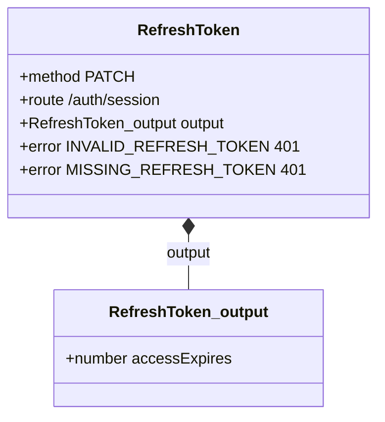

# RefreshToken

```mermaid
classDiagram
  class RefreshToken {
    +method PATCH
    +route /auth/session
    +RefreshToken_output output
    +error INVALID_REFRESH_TOKEN 401
    +error MISSING_REFRESH_TOKEN 401
  }
  class RefreshToken_output {
    +number accessExpires
  }
  RefreshToken *-- RefreshToken_output : output
```
