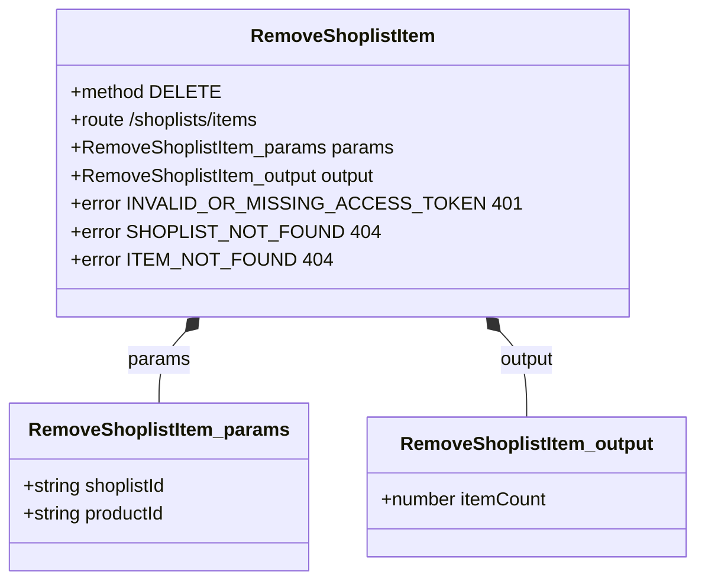

# RemoveShoplistItem

```mermaid
classDiagram
  class RemoveShoplistItem {
    +method DELETE
    +route /shoplists/items
    +RemoveShoplistItem_params params
    +RemoveShoplistItem_output output
    +error INVALID_OR_MISSING_ACCESS_TOKEN 401
    +error SHOPLIST_NOT_FOUND 404
    +error ITEM_NOT_FOUND 404
  }
  class RemoveShoplistItem_params {
    +string shoplistId
    +string productId
  }
  class RemoveShoplistItem_output {
    +number itemCount
  }
  RemoveShoplistItem *-- RemoveShoplistItem_params : params
  RemoveShoplistItem *-- RemoveShoplistItem_output : output
```
