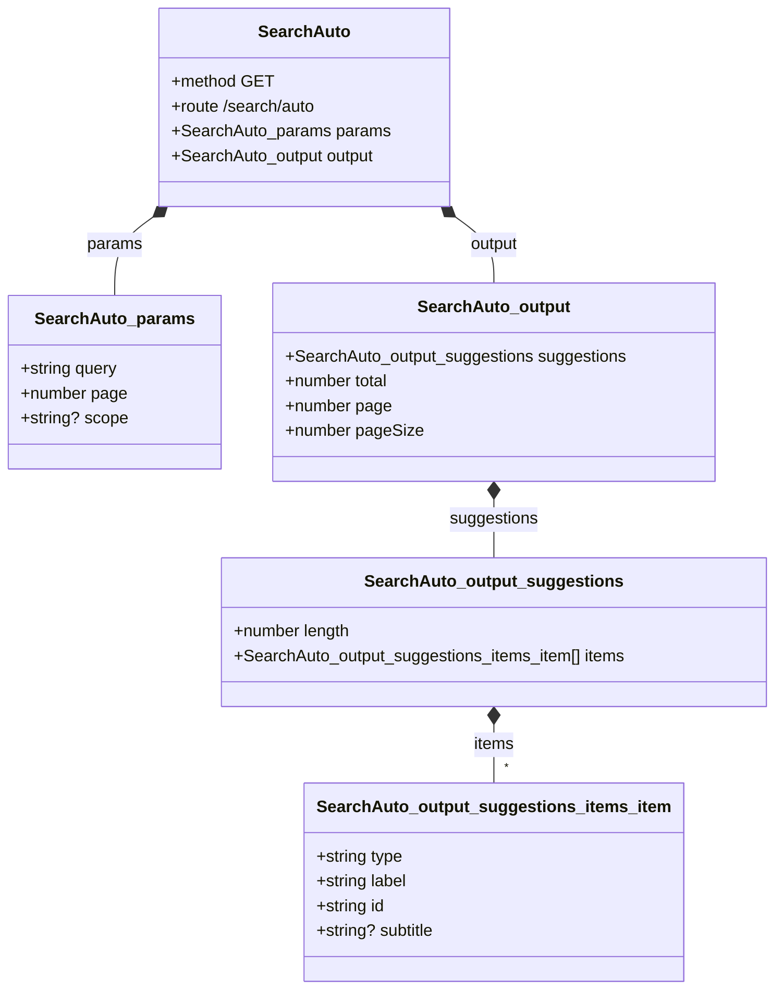

# SearchAuto

```mermaid
classDiagram
  class SearchAuto {
    +method GET
    +route /search/auto
    +SearchAuto_params params
    +SearchAuto_output output
  }
  class SearchAuto_params {
    +string query
    +number page
    +string? scope
  }
  class SearchAuto_output_suggestions_items_item {
    +string type
    +string label
    +string id
    +string? subtitle
  }
  class SearchAuto_output_suggestions {
    +number length
    +SearchAuto_output_suggestions_items_item[] items
  }
  class SearchAuto_output {
    +SearchAuto_output_suggestions suggestions
    +number total
    +number page
    +number pageSize
  }
  SearchAuto *-- SearchAuto_params : params
  SearchAuto_output_suggestions *-- "*" SearchAuto_output_suggestions_items_item : items
  SearchAuto_output *-- SearchAuto_output_suggestions : suggestions
  SearchAuto *-- SearchAuto_output : output
```
