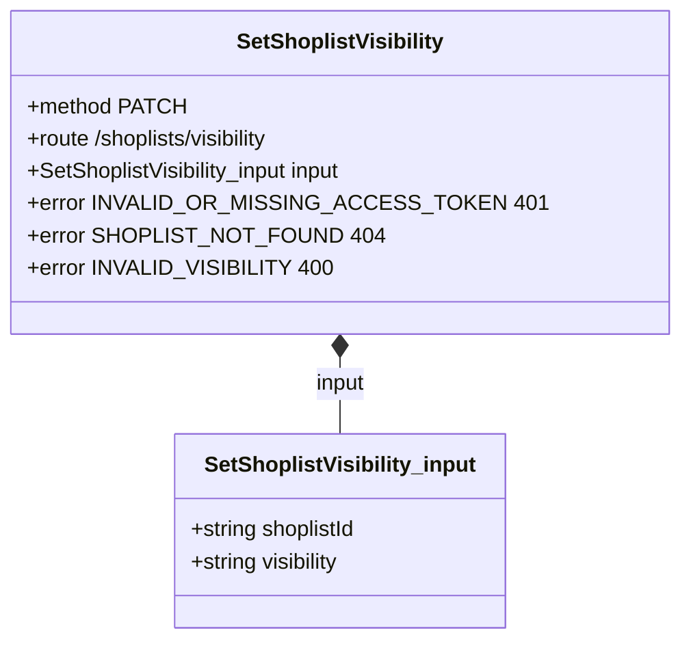

# SetShoplistVisibility

```mermaid
classDiagram
  class SetShoplistVisibility {
    +method PATCH
    +route /shoplists/visibility
    +SetShoplistVisibility_input input
    +error INVALID_OR_MISSING_ACCESS_TOKEN 401
    +error SHOPLIST_NOT_FOUND 404
    +error INVALID_VISIBILITY 400
  }
  class SetShoplistVisibility_input {
    +string shoplistId
    +string visibility
  }
  SetShoplistVisibility *-- SetShoplistVisibility_input : input
```
