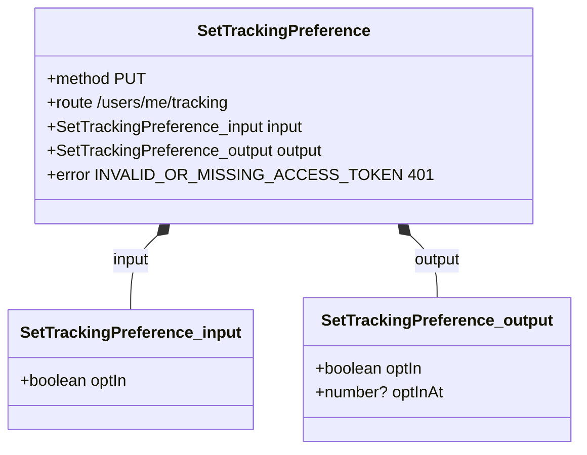

# SetTrackingPreference

```mermaid
classDiagram
  class SetTrackingPreference {
    +method PUT
    +route /users/me/tracking
    +SetTrackingPreference_input input
    +SetTrackingPreference_output output
    +error INVALID_OR_MISSING_ACCESS_TOKEN 401
  }
  class SetTrackingPreference_input {
    +boolean optIn
  }
  class SetTrackingPreference_output {
    +boolean optIn
    +number? optInAt
  }
  SetTrackingPreference *-- SetTrackingPreference_input : input
  SetTrackingPreference *-- SetTrackingPreference_output : output
```
