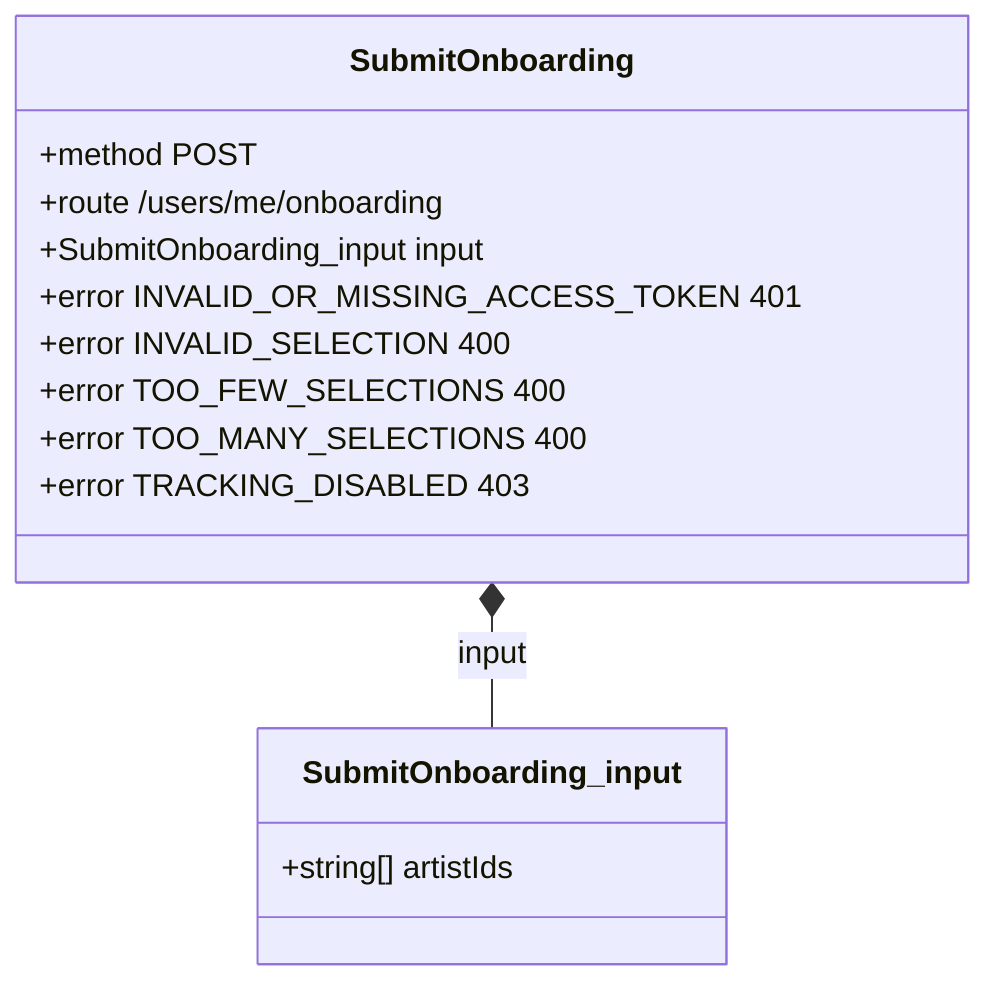

# SubmitOnboarding

```mermaid
classDiagram
  class SubmitOnboarding {
    +method POST
    +route /users/me/onboarding
    +SubmitOnboarding_input input
    +error INVALID_OR_MISSING_ACCESS_TOKEN 401
    +error INVALID_SELECTION 400
    +error TOO_FEW_SELECTIONS 400
    +error TOO_MANY_SELECTIONS 400
    +error TRACKING_DISABLED 403
  }
  class SubmitOnboarding_input {
    +string[] artistIds
  }
  SubmitOnboarding *-- SubmitOnboarding_input : input
```
