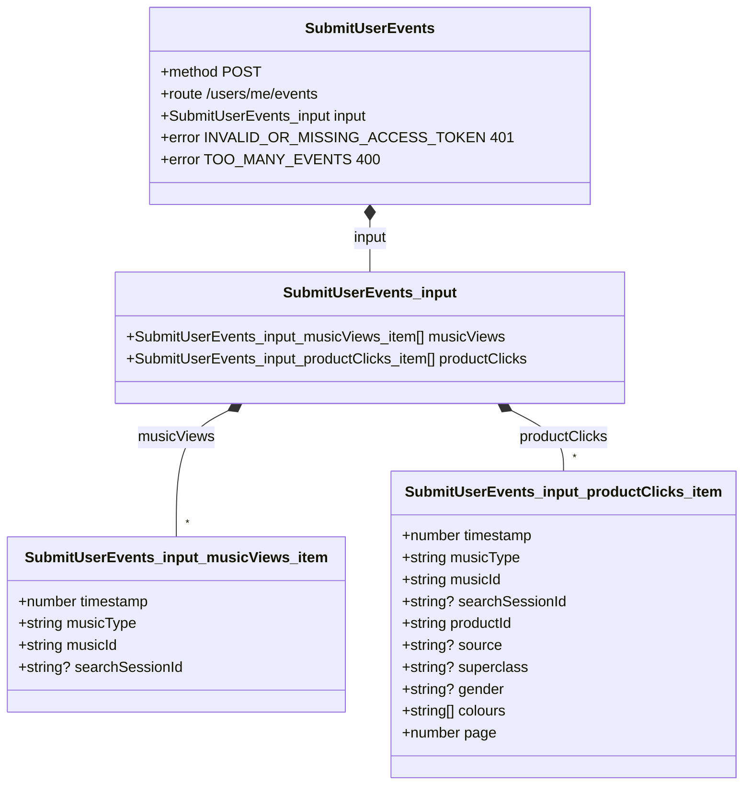

# SubmitUserEvents

```mermaid
classDiagram
  class SubmitUserEvents {
    +method POST
    +route /users/me/events
    +SubmitUserEvents_input input
    +error INVALID_OR_MISSING_ACCESS_TOKEN 401
    +error TOO_MANY_EVENTS 400
  }
  class SubmitUserEvents_input_musicViews_item {
    +number timestamp
    +string musicType
    +string musicId
    +string? searchSessionId
  }
  class SubmitUserEvents_input_productClicks_item {
    +number timestamp
    +string musicType
    +string musicId
    +string? searchSessionId
    +string productId
    +string? source
    +string? superclass
    +string? gender
    +string[] colours
    +number page
  }
  class SubmitUserEvents_input {
    +SubmitUserEvents_input_musicViews_item[] musicViews
    +SubmitUserEvents_input_productClicks_item[] productClicks
  }
  SubmitUserEvents_input *-- "*" SubmitUserEvents_input_musicViews_item : musicViews
  SubmitUserEvents_input *-- "*" SubmitUserEvents_input_productClicks_item : productClicks
  SubmitUserEvents *-- SubmitUserEvents_input : input
```
