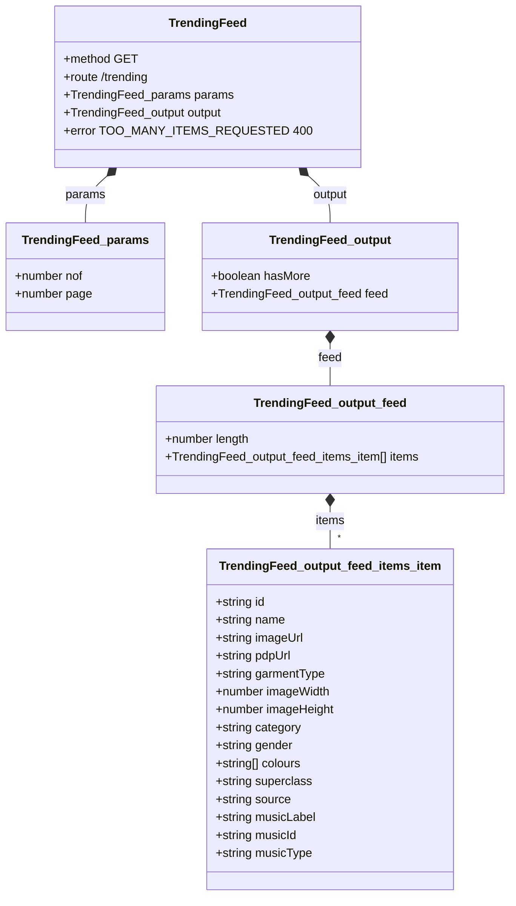

# TrendingFeed

```mermaid
classDiagram
  class TrendingFeed {
    +method GET
    +route /trending
    +TrendingFeed_params params
    +TrendingFeed_output output
    +error TOO_MANY_ITEMS_REQUESTED 400
  }
  class TrendingFeed_params {
    +number nof
    +number page
  }
  class TrendingFeed_output_feed_items_item {
    +string id
    +string name
    +string imageUrl
    +string pdpUrl
    +string garmentType
    +number imageWidth
    +number imageHeight
    +string category
    +string gender
    +string[] colours
    +string superclass
    +string source
    +string musicLabel
    +string musicId
    +string musicType
  }
  class TrendingFeed_output_feed {
    +number length
    +TrendingFeed_output_feed_items_item[] items
  }
  class TrendingFeed_output {
    +boolean hasMore
    +TrendingFeed_output_feed feed
  }
  TrendingFeed *-- TrendingFeed_params : params
  TrendingFeed_output_feed *-- "*" TrendingFeed_output_feed_items_item : items
  TrendingFeed_output *-- TrendingFeed_output_feed : feed
  TrendingFeed *-- TrendingFeed_output : output
```
