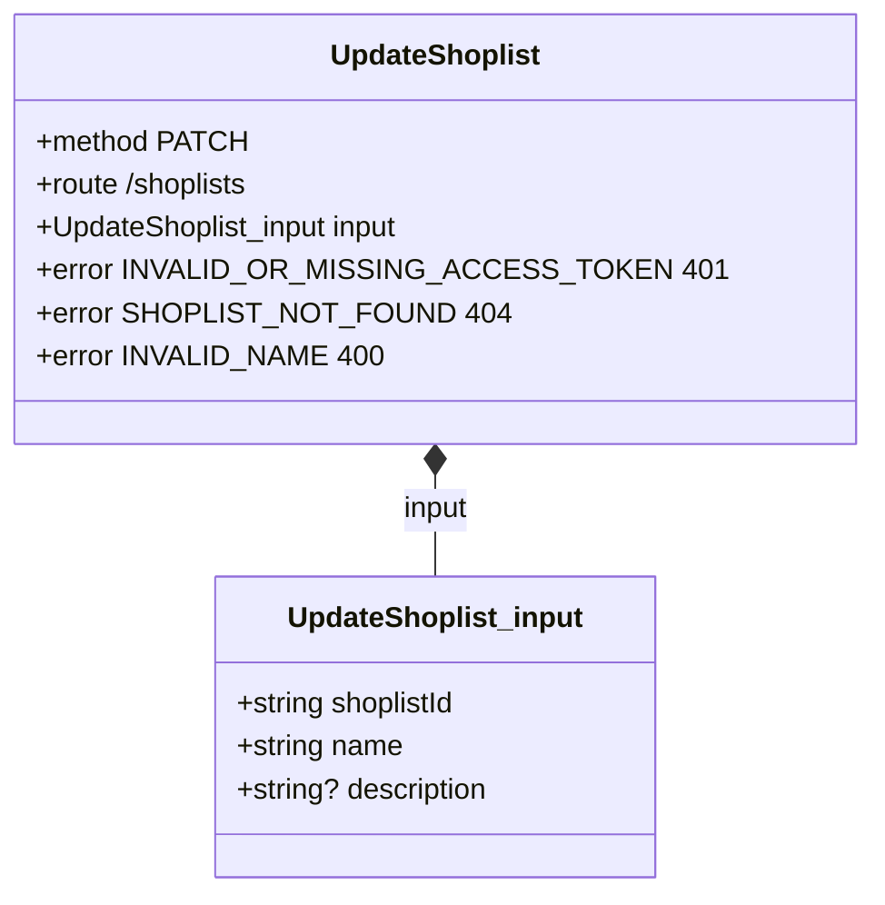

# UpdateShoplist

```mermaid
classDiagram
  class UpdateShoplist {
    +method PATCH
    +route /shoplists
    +UpdateShoplist_input input
    +error INVALID_OR_MISSING_ACCESS_TOKEN 401
    +error SHOPLIST_NOT_FOUND 404
    +error INVALID_NAME 400
  }
  class UpdateShoplist_input {
    +string shoplistId
    +string name
    +string? description
  }
  UpdateShoplist *-- UpdateShoplist_input : input
```
